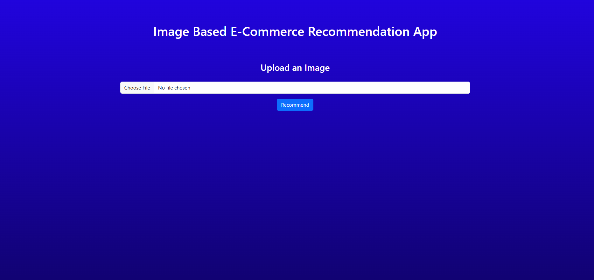
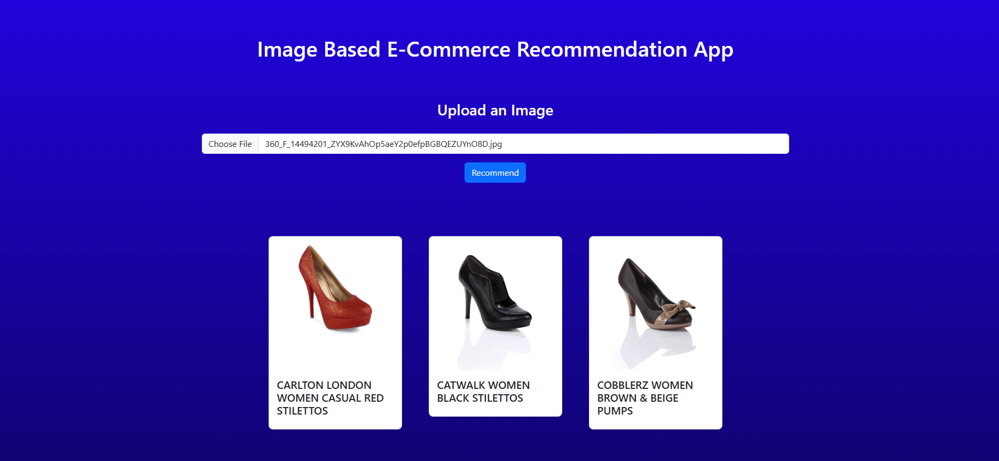

# Image-Based Recommender System

A powerful image-based recommendation system that uses deep learning to find visually similar images. This system uses ResNet50, a pre-trained convolutional neural network, to extract features from images and recommend similar images based on visual similarity.

## Features

- Upload images to find visually similar images
- Uses ResNet50 for feature extraction
- Fast and efficient similarity search
- Web-based interface for easy interaction
- Real-time recommendations

## Screenshots

### Homepage


### Results Page



## ⭐ Star the Repository

If you find this project useful, please consider giving it a star! Your support helps the project grow and reach more people.

## Prerequisites

- Python 3.12
- TensorFlow 2.19.0 or higher
- FastAPI
- Other dependencies listed in `pyproject.toml`

## Installation

### Local Installation

1. Clone the repository:
```bash
git clone https://github.com/yourusername/image-based-recommender.git
cd image-based-recommender
```

2. Install dependencies using pip:
```bash
pip install .
```
Or if you want to install in development mode:
```bash
pip install -e .
```

### Docker Installation

1. Make sure you have Docker and Docker Compose installed on your system.

2. Clone the repository:
```bash
git clone https://github.com/yourusername/image-based-recommender.git
cd image-based-recommender
```

3. Build and start the Docker container:
```bash
docker-compose up --build
```

4. The application will be available at `http://localhost:8000`

## Project Structure

```
image-based-recommender/
├── src/                  # Source code
│   ├── __init__.py      # Package initialization
│   ├── app.py           # Main FastAPI application
│   └── helper.py        # Helper functions for feature extraction
├── static/              # Static files and images
├── templates/           # HTML templates
├── research/            # Research and development files
├── artifacts/           # Model artifacts and data
├── Dockerfile           # Docker configuration
├── docker-compose.yml   # Docker Compose configuration
└── pyproject.toml       # Project dependencies
```

## Usage

1. Start the server:
```bash
uvicorn src.app:app --reload
```

2. Open your browser and navigate to `http://localhost:8000`

3. Upload an image through the web interface to get recommendations for similar images

## How It Works

1. The system uses ResNet50, a pre-trained CNN model, to extract features from images
2. When you upload an image, it:
   - Preprocesses the image to 224x224 pixels
   - Extracts features using ResNet50
   - Normalizes the feature vector
   - Computes similarity with other images
   - Returns the most similar images

## API Endpoints

- `GET /`: Homepage with upload interface
- `POST /upload`: Upload an image and get recommendations

## Contributing

Contributions are welcome! Please feel free to submit a Pull Request.

## License

This project is licensed under the MIT License - see the LICENSE file for details.